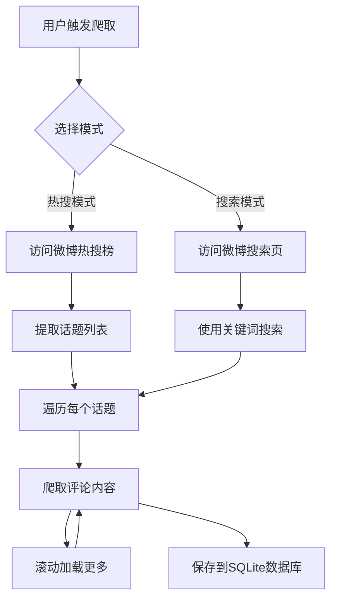
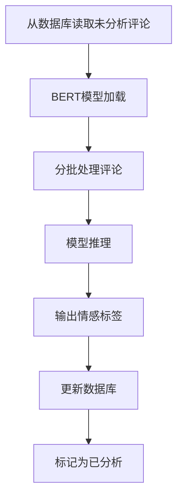
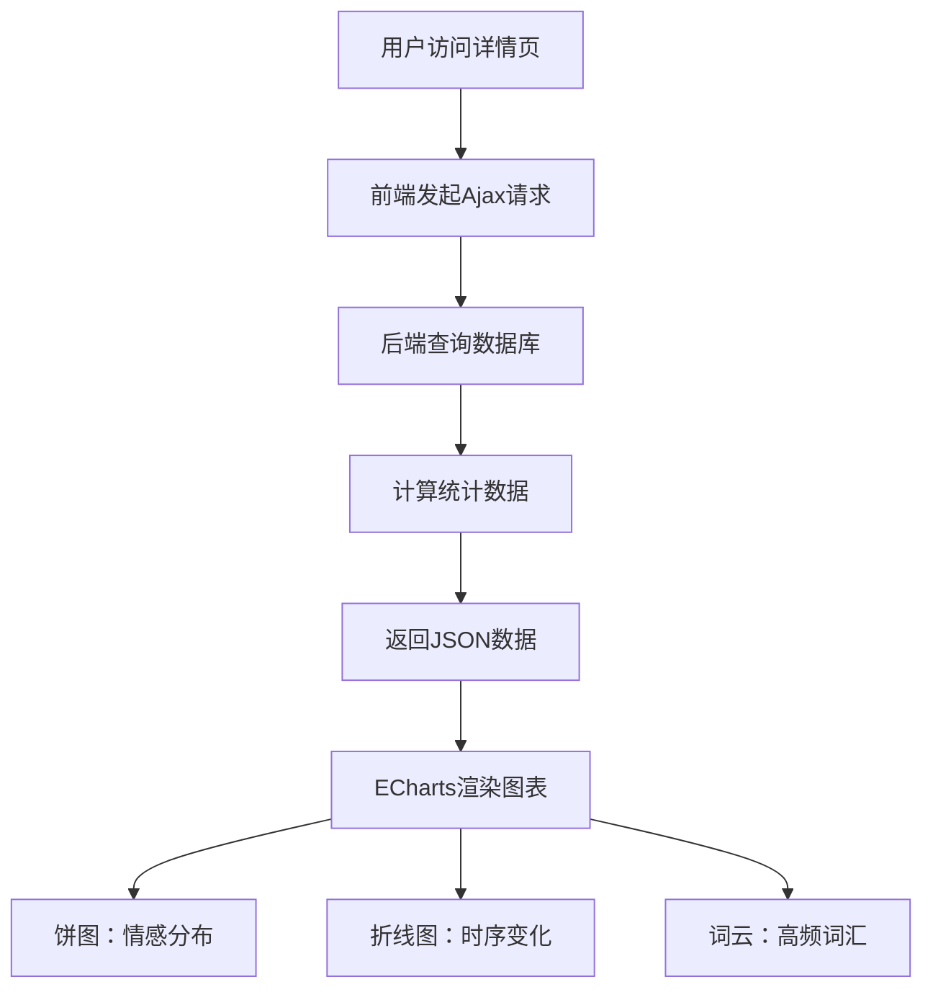
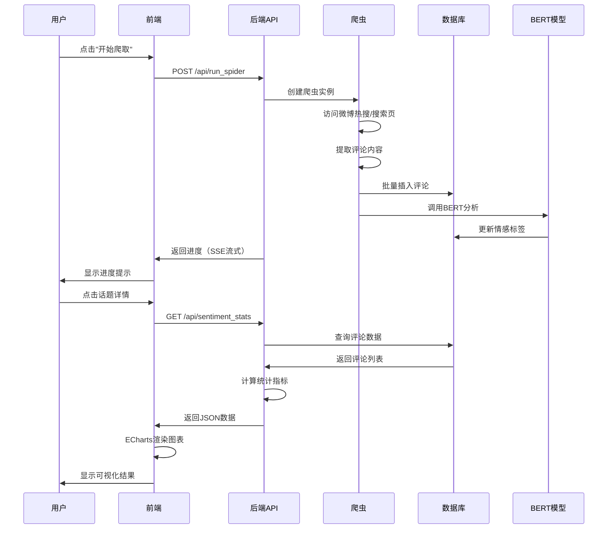

# 01_系统架构与数据流转

## 一、系统整体架构

本系统是一个典型的 **前后端分离架构**，采用 Flask 作为后端框架，ECharts 作为前端可视化库，BERT 模型作为核心情感分析引擎。

### 系统组成

```
┌─────────────────────────────────────────────────────────────┐
│                      用户界面层（前端）                      │
│  ┌──────────────┐  ┌──────────────┐  ┌──────────────┐ │
│  │  index.html  │  │ detail.html  │  │  SweetAlert  │ │
│  │  (首页)      │  │ (详情页)     │  │  (弹窗组件)   │ │
│  └──────────────┘  └──────────────┘  └──────────────┘ │
└─────────────────────────────────────────────────────────────┘
                            ↕ HTTP/Ajax
┌─────────────────────────────────────────────────────────────┐
│                    应用逻辑层（后端）                        │
│  ┌──────────────┐  ┌──────────────┐  ┌──────────────┐ │
│  │   app.py     │  │  weibo_      │  │  model_      │ │
│  │  (Flask路由)  │  │  spider.py   │  │  inference.  │ │
│  │              │  │  (爬虫模块)    │  │  py (推理)    │ │
│  └──────────────┘  └──────────────┘  └──────────────┘ │
└─────────────────────────────────────────────────────────────┘
                            ↕
┌─────────────────────────────────────────────────────────────┐
│                    数据持久层（数据库）                       │
│  ┌──────────────┐  ┌──────────────┐  ┌──────────────┐ │
│  │  SQLite      │  │  comments    │  │  ranks       │ │
│  │  (weibo.db)  │  │  表          │  │  表          │ │
│  └──────────────┘  └──────────────┘  └──────────────┘ │
└─────────────────────────────────────────────────────────────┘
                            ↕
┌─────────────────────────────────────────────────────────────┐
│                    数据源层（外部）                         │
│  ┌──────────────┐  ┌──────────────┐  ┌──────────────┐ │
│  │  微博热搜榜   │  │  微博搜索页   │  │  BERT模型    │ │
│  │  (s.weibo.   │  │  (s.weibo.   │  │  (预训练模型)  │ │
│  │  com/top)     │  │  com/weibo)  │  │              │ │
│  └──────────────┘  └──────────────┘  └──────────────┘ │
└─────────────────────────────────────────────────────────────┘
```

## 二、数据流转完整生命周期

### 1. 数据采集阶段（爬虫）



**代码位置：** `weibo_spider.py` 第 301-500 行

**详细说明：**
- 用户在首页点击"开始爬取"按钮，前端发送 POST 请求到 `/api/run_spider`
- 后端创建 `WeiboSpider` 实例，根据用户选择的模式（热搜/搜索）执行不同的爬取逻辑
- 热搜模式：访问 `https://s.weibo.com/top/summary`，提取前 N 个热门话题
- 搜索模式：访问 `https://s.weibo.com/weibo?q=关键词`，直接搜索指定话题
- 对于每个话题，爬虫会滚动页面加载更多评论，直到达到目标数量
- 每条评论包含：话题关键词、评论内容、发布时间

### 2. 数据存储阶段（数据库）


**代码位置：** `models.py` 第 18-40 行

**详细说明：**
- 爬虫将评论数据封装为 `Comment` 对象列表
- 使用 `Comment.batch_insert()` 方法批量插入数据库
- 数据库文件：`weibo.db`（SQLite格式）
- 核心表：`comments` 表，存储所有评论数据

### 3. 情感分析阶段（BERT推理）



**代码位置：** `model_inference.py` 和 `evaluate.py`

**详细说明：**
- 从数据库查询 `sentiment_label` 为 `None` 的评论
- 加载预训练的 BERT 模型（`bert-base-chinese`）
- 使用批量推理提高效率（batch_size=32）
- 每条评论输出：情感标签（positive/neutral/negative）+ 置信度
- 更新数据库中的 `sentiment_label` 和 `confidence` 字段

### 4. 数据可视化阶段（前端渲染）



**代码位置：** `templates/detail.html` 和 `app.py` 第 60-120 行

**详细说明：**
- 用户点击某个话题，跳转到 `/detail/<topic>` 页面
- 前端使用 `fetch()` 发起异步请求到后端 API
- 后端查询该话题的所有评论，计算情感分布、时序变化、高频词汇
- 返回 JSON 格式的数据给前端
- 前端使用 ECharts 库渲染三个图表：饼图、折线图、词云

## 三、核心数据流图



## 四、关键技术点

### 1. 流式响应（Server-Sent Events）
- **位置：** `app.py` 第 250-350 行
- **作用：** 实时推送爬虫进度到前端，避免长时间等待
- **实现：** 使用 `stream_with_context` 和 `queue.Queue` 传递进度信息

### 2. 批量数据库操作
- **位置：** `models.py` 第 35-40 行
- **作用：** 提高数据库写入效率
- **实现：** 使用 `bulk_save_objects` 批量插入，减少数据库连接次数

### 3. 异步任务处理
- **位置：** `app.py` 第 300-400 行
- **作用：** 爬虫任务在后台线程运行，不阻塞主线程
- **实现：** 使用 `threading.Thread` 创建独立线程执行爬虫任务

### 4. 模型推理优化
- **位置：** `model_inference.py`
- **作用：** 提高BERT推理速度
- **实现：** 批量推理（batch_size=32），使用GPU加速（如果可用）

## 五、答辩常见问题

### Q1: 你的系统是如何保证数据实时性的？
**标准回答：**
我的系统采用了流式响应（Server-Sent Events）技术。在爬虫运行过程中，后端会实时推送进度信息到前端，用户可以在页面上看到"正在爬取第X个话题"、"已完成Y条评论的情感分析"等实时进度。这比传统的"等待完成后一次性返回"的方式用户体验更好，也方便用户了解系统运行状态。

### Q2: 为什么选择SQLite而不是MySQL？
**标准回答：**
SQLite是一个轻量级的嵌入式数据库，非常适合我的毕设场景。首先，它不需要单独的数据库服务器，部署非常简单，只需要一个.db文件。其次，对于微博评论这种读多写少的应用场景，SQLite的性能完全够用。最后，SQLite支持标准的SQL语法，方便我使用SQLAlchemy ORM进行数据库操作，代码可读性和可维护性都很好。

### Q3: 你的系统如何处理大量数据的？
**标准回答：**
我的系统在多个层面做了优化。第一，数据库层面使用批量插入（bulk_save_objects），减少数据库连接次数。第二，模型推理层面使用批量推理（batch_size=32），充分利用GPU加速。第三，前端层面使用异步请求，避免页面卡顿。第四，爬虫层面实现了"保量爬取"逻辑，确保能够获取到目标数量的数据。这些优化使得系统能够高效处理几百甚至上千条微博评论。

### Q4: BERT模型是如何集成到你的系统中的？
**标准回答：**
我使用了Hugging Face的Transformers库来加载预训练的BERT模型（bert-base-chinese）。在`model_inference.py`中，我封装了一个`SentimentAnalyzer`类，负责模型的加载、推理和结果解析。当爬虫获取到评论后，会调用这个类的`batch_predict`方法进行批量情感分析，然后将结果更新到数据库中。整个推理过程是自动化的，用户只需要点击"开始爬取"，系统就会自动完成数据采集、情感分析和可视化展示的全流程。
