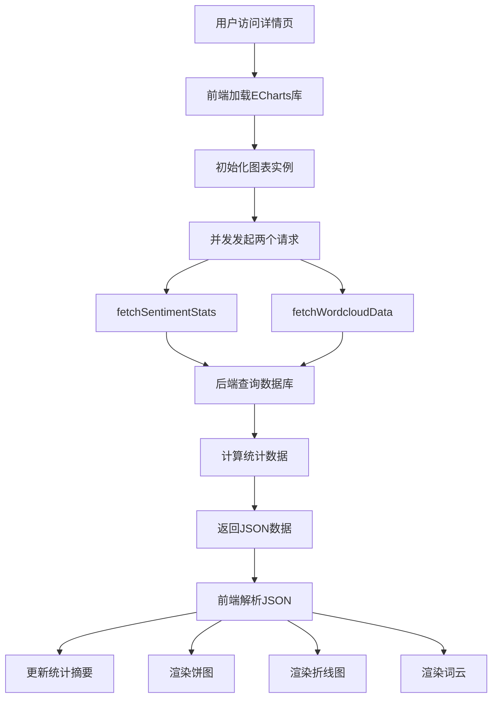

# 05_前端可视化与ECharts渲染

## 一、前端技术栈

### 1. 核心库

**代码位置：** `templates/detail.html` 第 7-8 行

```html
<script src="https://cdn.jsdelivr.net/npm/echarts@5.4.3/dist/echarts.min.js"></script>
<script src="https://cdn.jsdelivr.net/npm/echarts-wordcloud@2.1.0/dist/echarts-wordcloud.min.js"></script>
```

**说明：**
- **ECharts**：百度开源的可视化库，支持多种图表类型（饼图、折线图、词云等）
- **echarts-wordcloud**：ECharts的词云插件，用于渲染词云图
- **CDN地址**：使用 jsDelivr CDN，加载速度快，稳定可靠

### 2. 页面结构

**代码位置：** `templates/detail.html` 第 1-20 行

```html
<!DOCTYPE html>
<html lang="zh-CN">
<head>
    <meta charset="UTF-8">
    <meta name="viewport" content="width=device-width, initial-scale=1.0">
    <title>{{ topic }} - 情感分析详情</title>
    <!-- 引入ECharts库 -->
</head>
<body>
    <div class="container">
        <!-- 头部区域 -->
        <div class="header">
            <div class="header-content">
                <h1>{{ topic }}</h1>
                <p>微博情感分析可视化</p>
            </div>
            <div class="header-export">
                <button class="export-btn csv" onclick="exportData('csv')">
                    <span>📄</span>
                    导出 CSV
                </button>
            </div>
        </div>
        
        <!-- 统计摘要 -->
        <div class="stats-summary">
            <div class="stats-grid">
                <div class="stat-item">
                    <div class="number" id="total-count">0</div>
                    <div class="label">总评论数</div>
                </div>
                <div class="stat-item">
                    <div class="number" id="positive-count">0</div>
                    <div class="label">积极评论</div>
                </div>
                <div class="stat-item">
                    <div class="number" id="neutral-count">0</div>
                    <div class="label">中性评论</div>
                </div>
                <div class="stat-item">
                    <div class="number" id="negative-count">0</div>
                    <div class="label">消极评论</div>
                </div>
            </div>
        </div>
        
        <!-- 图表区域 -->
        <div class="charts-grid">
            <div class="chart-card">
                <h2>情感分布（饼图）</h2>
                <div id="pie-chart" class="chart-container"></div>
            </div>
            <div class="chart-card">
                <h2>时序变化（折线图）</h2>
                <div id="line-chart" class="chart-container"></div>
            </div>
            <div class="chart-card">
                <h2>高频词汇（词云）</h2>
                <div id="wordcloud-chart" class="chart-container"></div>
            </div>
        </div>
    </div>
</body>
</html>
```

**说明：**
- **头部区域**：显示话题名称和导出按钮
- **统计摘要**：显示总评论数、积极/中性/消极评论数量
- **图表区域**：包含三个图表容器（饼图、折线图、词云）

## 二、数据获取流程

### 1. 初始化ECharts实例

**代码位置：** `templates/detail.html` 第 355-357 行

```javascript
const pieChart = echarts.init(document.getElementById('pie-chart'));
const lineChart = echarts.init(document.getElementById('line-chart'));
const wordcloudChart = echarts.init(document.getElementById('wordcloud-chart'));
```

**说明：**
- 使用 `echarts.init()` 方法初始化三个图表实例
- 参数是DOM元素（通过 `getElementById` 获取）
- 返回的实例用于后续的配置和渲染

**关键变量：**
- `pieChart`：饼图实例
- `lineChart`：折线图实例
- `wordcloudChart`：词云实例

---

### 2. 获取情感统计数据

**代码位置：** `templates/detail.html` 第 359-376 行

```javascript
function fetchSentimentStats() {
    return fetch(`/api/sentiment_stats/${encodeURIComponent(topic)}`)
        .then(response => response.json())
        .then(data => {
            if (data.success) {
                updateStats(data);
                renderPieChart(data.pie_chart.data);
                renderLineChart(data.line_chart.data);
            } else {
                alert('获取数据失败: ' + data.error);
            }
        })
        .catch(error => {
            console.error('Error:', error);
            alert('请求失败，请检查网络连接');
        });
}
```

**详细说明：**

#### 步骤1：发起HTTP请求
```javascript
fetch(`/api/sentiment_stats/${encodeURIComponent(topic)}`)
```

**作用：**
- 使用 `fetch()` API 发起GET请求
- 请求URL：`/api/sentiment_stats/<topic>`
- `encodeURIComponent(topic)`：对话题关键词进行URL编码，防止特殊字符导致请求失败

**示例：**
- 话题：`人工智能` → 编码后：`%E4%BA%BA%E5%B7%A5%E6%99%BA%E8%83%BD`
- 完整URL：`/api/sentiment_stats/%E4%BA%BA%E5%B7%A5%E6%99%BA%E8%83%BD`

#### 步骤2：解析响应数据
```javascript
.then(response => response.json())
```

**作用：**
- 将响应体解析为JSON格式
- 返回一个Promise，解析后的数据传递给下一个 `.then()`

**返回数据格式：**
```json
{
    "success": true,
    "topic": "人工智能",
    "total": 100,
    "pie_chart": {
        "data": [
            {"name": "积极", "value": 60},
            {"name": "中性", "value": 25},
            {"name": "消极", "value": 15}
        ]
    },
    "line_chart": {
        "data": [
            {"time": "2024-03-25 10:00", "value": 0.5},
            {"time": "2024-03-25 11:00", "value": 0.3}
        ]
    }
}
```

#### 步骤3：更新页面数据
```javascript
if (data.success) {
    updateStats(data);
    renderPieChart(data.pie_chart.data);
    renderLineChart(data.line_chart.data);
}
```

**作用：**
- 检查请求是否成功（`data.success === true`）
- 如果成功，调用三个函数更新页面：
  - `updateStats(data)`：更新统计摘要
  - `renderPieChart(data.pie_chart.data)`：渲染饼图
  - `renderLineChart(data.line_chart.data)`：渲染折线图

#### 步骤4：错误处理
```javascript
.catch(error => {
    console.error('Error:', error);
    alert('请求失败，请检查网络连接');
});
```

**作用：**
- 捕获请求过程中的错误
- 在控制台输出错误信息
- 弹出提示框告知用户

---

### 3. 获取词云数据

**代码位置：** `templates/detail.html` 第 377-392 行

```javascript
function fetchWordcloudData() {
    return fetch(`/api/wordcloud/${encodeURIComponent(topic)}`)
        .then(response => response.json())
        .then(data => {
            if (data.success) {
                renderWordcloudChart(data.wordcloud.data);
            } else {
                console.error('获取词云数据失败:', data.error);
            }
        })
        .catch(error => {
            console.error('Error:', error);
        });
}
```

**详细说明：**

#### 步骤1：发起HTTP请求
```javascript
fetch(`/api/wordcloud/${encodeURIComponent(topic)}`)
```

**作用：**
- 使用 `fetch()` API 发起GET请求
- 请求URL：`/api/wordcloud/<topic>`
- 获取指定话题的高频词汇数据

**返回数据格式：**
```json
{
    "success": true,
    "topic": "人工智能",
    "wordcloud": {
        "data": [
            {"name": "技术", "value": 850},
            {"name": "创新", "value": 720},
            {"name": "应用", "value": 680}
        ]
    }
}
```

#### 步骤2：渲染词云
```javascript
if (data.success) {
    renderWordcloudChart(data.wordcloud.data);
}
```

**作用：**
- 检查请求是否成功
- 如果成功，调用 `renderWordcloudChart()` 渲染词云图

---

### 4. 并发请求

**代码位置：** `templates/detail.html` 第 581 行

```javascript
Promise.all([fetchSentimentStats(), fetchWordcloudData()])
    .then(() => {
        hideLoading();
    });
```

**说明：**
- 使用 `Promise.all()` 同时发起两个请求
- 两个请求都完成后，隐藏加载动画
- 提高页面加载速度（并发请求比串行请求快）

---

## 三、图表渲染

### 1. 饼图渲染（情感分布）

**代码位置：** `templates/detail.html` 第 400-451 行

```javascript
function renderPieChart(data) {
    const option = {
        tooltip: {
            trigger: 'item',
            formatter: '{b}: {c} ({d}%)'
        },
        legend: {
            orient: 'vertical',
            left: 'left'
        },
        color: ['#5470c6', '#91cc75', '#ee6666'],
        series: [
            {
                name: '情感分布',
                type: 'pie',
                radius: ['40%', '70%'],
                avoidLabelOverlap: false,
                itemStyle: {
                    borderRadius: 10,
                    borderColor: '#fff',
                    borderWidth: 2
                },
                label: {
                    show: true,
                    formatter: '{b}: {d}%'
                },
                emphasis: {
                    label: {
                        show: true,
                        fontSize: 20,
                        fontWeight: 'bold'
                    }
                },
                data: data
            }
        ]
    };
    
    pieChart.setOption(option);
}
```

**详细说明：**

#### 配置项解析

1. **tooltip（提示框）**
```javascript
tooltip: {
    trigger: 'item',
    formatter: '{b}: {c} ({d}%)'
}
```

**作用：**
- 鼠标悬停时显示提示框
- `trigger: 'item'`：触发方式为数据项（饼图扇区）
- `formatter`：自定义提示框内容
  - `{b}`：数据项名称（如"积极"）
  - `{c}`：数据项值（如60）
  - `{d}`：百分比（如60%）

**示例：** 鼠标悬停在"积极"扇区上，提示框显示：`积极: 60 (60%)`

2. **legend（图例）**
```javascript
legend: {
    orient: 'vertical',
    left: 'left'
}
```

**作用：**
- 显示图例
- `orient: 'vertical'`：垂直排列
- `left: 'left'`：位置在左侧

3. **color（颜色）**
```javascript
color: ['#5470c6', '#91cc75', '#ee6666']
```

**作用：**
- 自定义颜色方案
- 蓝色（#5470c6）：积极
- 绿色（#91cc75）：中性
- 红色（#ee6666）：消极

4. **series（系列）**
```javascript
series: [
    {
        name: '情感分布',
        type: 'pie',
        radius: ['40%', '70%'],
        avoidLabelOverlap: false,
        itemStyle: {
            borderRadius: 10,
            borderColor: '#fff',
            borderWidth: 2
        },
        label: {
            show: true,
            formatter: '{b}: {d}%'
        },
        emphasis: {
            label: {
                show: true,
                fontSize: 20,
                fontWeight: 'bold'
            }
        },
        data: data
    }
]
```

**作用：**
- `type: 'pie'`：图表类型为饼图
- `radius: ['40%', '70%']`：内半径40%，外半径70%（环形饼图）
- `itemStyle`：扇区样式（圆角、边框）
- `label`：标签显示（名称和百分比）
- `emphasis`：高亮样式（鼠标悬停时放大标签）
- `data`：数据（从后端获取的JSON数据）

**数据绑定：**
```javascript
data: data  // data = [{"name": "积极", "value": 60}, ...]
```

#### 渲染方法
```javascript
pieChart.setOption(option);
```

**作用：**
- 将配置应用到饼图实例
- ECharts自动渲染图表

---

### 2. 折线图渲染（时序变化）

**代码位置：** `templates/detail.html` 第 453-510 行

```javascript
function renderLineChart(data) {
    const option = {
        tooltip: {
            trigger: 'axis',
            formatter: '{b}<br/>{a}: {c}'
        },
        xAxis: {
            type: 'category',
            data: data.map(item => item.time)
        },
        yAxis: {
            type: 'value',
            min: -1,
            max: 1,
            axisLabel: {
                formatter: function(value) {
                    if (value === 1) return '积极';
                    if (value === 0) return '中性';
                    if (value === -1) return '消极';
                    return value;
                }
            }
        },
        series: [
            {
                name: '情感值',
                type: 'line',
                data: data.map(item => item.value),
                smooth: true,
                lineStyle: {
                    width: 3,
                    color: '#667eea'
                },
                areaStyle: {
                    color: {
                        type: 'linear',
                        x: 0,
                        y: 0,
                        x2: 0,
                        y2: 1,
                        colorStops: [
                            { offset: 0, color: 'rgba(102, 126, 234, 0.3)' },
                            { offset: 1, color: 'rgba(102, 126, 234, 0.05)' }
                        ]
                    }
                },
                markLine: {
                    data: [
                        { yAxis: 0, label: { formatter: '中性' } }
                    ],
                    lineStyle: {
                        color: '#999',
                        type: 'dashed'
                    }
                }
            }
        ]
    };
    
    lineChart.setOption(option);
}
```

**详细说明：**

#### 配置项解析

1. **xAxis（X轴）**
```javascript
xAxis: {
    type: 'category',
    data: data.map(item => item.time)
}
```

**作用：**
- X轴类型为类目轴（时间点）
- 数据从后端JSON中提取
- `data.map(item => item.time)`：提取所有时间点

**数据绑定：**
```javascript
data: ["2024-03-25 10:00", "2024-03-25 11:00", ...]
```

2. **yAxis（Y轴）**
```javascript
yAxis: {
    type: 'value',
    min: -1,
    max: 1,
    axisLabel: {
        formatter: function(value) {
            if (value === 1) return '积极';
            if (value === 0) return '中性';
            if (value === -1) return '消极';
            return value;
        }
    }
}
```

**作用：**
- Y轴类型为数值轴（情感值）
- 范围：-1（消极）到 1（积极）
- 自定义标签格式：-1显示"消极"，0显示"中性"，1显示"积极"

3. **series（系列）**
```javascript
series: [
    {
        name: '情感值',
        type: 'line',
        data: data.map(item => item.value),
        smooth: true,
        lineStyle: {
            width: 3,
            color: '#667eea'
        },
        areaStyle: {
            color: {
                type: 'linear',
                x: 0,
                y: 0,
                x2: 0,
                y2: 1,
                colorStops: [
                    { offset: 0, color: 'rgba(102, 126, 234, 0.3)' },
                    { offset: 1, color: 'rgba(102, 126, 234, 0.05)' }
                ]
            }
        },
        markLine: {
            data: [
                { yAxis: 0, label: { formatter: '中性' } }
            ],
            lineStyle: {
                color: '#999',
                type: 'dashed'
            }
        }
    }
]
```

**作用：**
- `type: 'line'`：图表类型为折线图
- `data: data.map(item => item.value)`：提取所有情感值
- `smooth: true`：平滑曲线
- `lineStyle`：线条样式（宽度3px，颜色#667eea）
- `areaStyle`：区域填充（渐变色）
- `markLine`：标记线（在y=0处画一条虚线，表示中性）

**数据绑定：**
```javascript
data: [0.5, 0.3, -0.2, 0.8, ...]
```

---

### 3. 词云渲染（高频词汇）

**代码位置：** `templates/detail.html` 第 512-562 行

```javascript
function renderWordcloudChart(data) {
    const option = {
        tooltip: {
            show: true
        },
        series: [
            {
                type: 'wordCloud',
                shape: 'circle',
                left: 'center',
                top: 'center',
                width: '100%',
                height: '100%',
                right: null,
                bottom: null,
                sizeRange: [12, 60],
                rotationRange: [-90, 90],
                rotationStep: 45,
                gridSize: 8,
                drawOutOfBound: false,
                textStyle: {
                    fontFamily: 'sans-serif',
                    fontWeight: 'bold',
                    color: function() {
                        return 'rgb(' + [
                            Math.round(Math.random() * 160),
                            Math.round(Math.random() * 160),
                            Math.round(Math.random() * 160)
                        ].join(',') + ')';
                    }
                },
                emphasis: {
                    focus: 'self',
                    textStyle: {
                        shadowBlur: 10,
                        shadowColor: '#333'
                    }
                },
                data: data
            }
        ]
    };
    
    wordcloudChart.setOption(option);
}
```

**详细说明：**

#### 配置项解析

1. **shape（形状）**
```javascript
shape: 'circle'
```

**作用：**
- 词云形状为圆形
- 其他可选值：'cardioid'（心形）、'diamond'（菱形）、'triangle-forward'（三角形）

2. **sizeRange（字体大小范围）**
```javascript
sizeRange: [12, 60]
```

**作用：**
- 字体大小范围：12px 到 60px
- 词频越高，字体越大

3. **rotationRange（旋转角度范围）**
```javascript
rotationRange: [-90, 90]
```

**作用：**
- 词汇旋转角度范围：-90度到90度
- 让词云更自然，避免所有词汇都是水平排列

4. **textStyle（文本样式）**
```javascript
textStyle: {
    fontFamily: 'sans-serif',
    fontWeight: 'bold',
    color: function() {
        return 'rgb(' + [
            Math.round(Math.random() * 160),
            Math.round(Math.random() * 160),
            Math.round(Math.random() * 160)
        ].join(',') + ')';
    }
}
```

**作用：**
- 字体：无衬线字体
- 字重：粗体
- 颜色：随机颜色（RGB格式）

5. **data（数据）**
```javascript
data: data  // data = [{"name": "技术", "value": 850}, ...]
```

**作用：**
- 词云数据（从后端获取的JSON数据）
- `name`：词汇
- `value`：权重（词频）

---

## 四、数据绑定流程

### 1. 完整数据流



### 2. 数据绑定示例

#### 后端返回数据（JSON格式）
```json
{
    "success": true,
    "topic": "人工智能",
    "total": 100,
    "pie_chart": {
        "data": [
            {"name": "积极", "value": 60},
            {"name": "中性", "value": 25},
            {"name": "消极", "value": 15}
        ]
    },
    "line_chart": {
        "data": [
            {"time": "2024-03-25 10:00", "value": 0.5},
            {"time": "2024-03-25 11:00", "value": 0.3}
        ]
    }
}
```

#### 前端解析并绑定数据

**饼图数据绑定：**
```javascript
// 代码位置：templates/detail.html 第 363 行
renderPieChart(data.pie_chart.data);

// data.pie_chart.data = [
//     {"name": "积极", "value": 60},
//     {"name": "中性", "value": 25},
//     {"name": "消极", "value": 15}
// ]

// 饼图配置中的数据绑定：
series: [
    {
        data: data  // 直接使用后端返回的数据
    }
]
```

**折线图数据绑定：**
```javascript
// 代码位置：templates/detail.html 第 364 行
renderLineChart(data.line_chart.data);

// data.line_chart.data = [
//     {"time": "2024-03-25 10:00", "value": 0.5},
//     {"time": "2024-03-25 11:00", "value": 0.3}
// ]

// 折线图配置中的数据绑定：
xAxis: {
    data: data.map(item => item.time)  // 提取时间点
},
series: [
    {
        data: data.map(item => item.value)  // 提取情感值
    }
]
```

**词云数据绑定：**
```javascript
// 代码位置：templates/detail.html 第 380 行
renderWordcloudChart(data.wordcloud.data);

// data.wordcloud.data = [
//     {"name": "技术", "value": 850},
//     {"name": "创新", "value": 720},
//     {"name": "应用", "value": 680}
// ]

// 词云配置中的数据绑定：
series: [
    {
        data: data  // 直接使用后端返回的数据
    }
]
```

---

## 五、答辩常见问题

### Q1: 你的前端是如何获取后端数据的？
**标准回答：**
我的前端使用JavaScript的`fetch()` API发起HTTP请求，获取后端数据。在详情页加载时，我会并发发起两个请求：一个请求`/api/sentiment_stats/<topic>`获取情感统计数据（饼图和折线图数据），另一个请求`/api/wordcloud/<topic>`获取词云数据。这两个请求使用`Promise.all()`同时发起，提高页面加载速度。后端返回JSON格式的数据，前端解析后，使用ECharts的`setOption()`方法将数据绑定到图表上。

### Q2: 饼图和折线图是如何将后端传来的JSON数据绑定到ECharts实例上的？
**标准回答：**
饼图和折线图的数据绑定方式略有不同。对于饼图，后端返回的数据格式是`[{"name": "积极", "value": 60}, ...]`，我直接将这个数组赋值给ECharts配置的`series[0].data`属性，ECharts会自动渲染。对于折线图，后端返回的数据格式是`[{"time": "2024-03-25 10:00", "value": 0.5}, ...]`，我需要分别提取时间点和情感值，赋值给`xAxis.data`和`series[0].data`属性。最后调用`pieChart.setOption(option)`和`lineChart.setOption(option)`方法，ECharts就会根据配置和数据渲染图表。

### Q3: 为什么使用ECharts而不是其他可视化库？
**标准回答：**
我选择ECharts是因为它功能强大、文档完善、社区活跃。首先，ECharts支持多种图表类型（饼图、折线图、词云等），满足我的需求。其次，ECharts的配置灵活，可以自定义样式、交互、动画等。最后，ECharts有丰富的中文文档和示例，学习成本低，开发效率高。而且ECharts性能优秀，能够流畅渲染大量数据。

### Q4: 你的前端是如何处理请求错误的？
**标准回答：**
我的前端在请求中使用了`.catch()`方法捕获错误。如果请求失败（比如网络错误、服务器错误），`.catch()`会捕获错误，在控制台输出错误信息，并弹出提示框告知用户"请求失败，请检查网络连接"。同时，我还检查后端返回的`success`字段，如果为`false`，也会弹出提示框显示错误信息。这样用户能够清楚地知道发生了什么问题，而不是看到空白页面。
